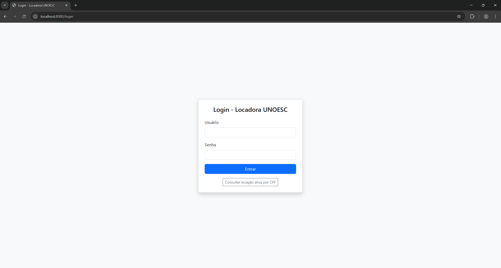
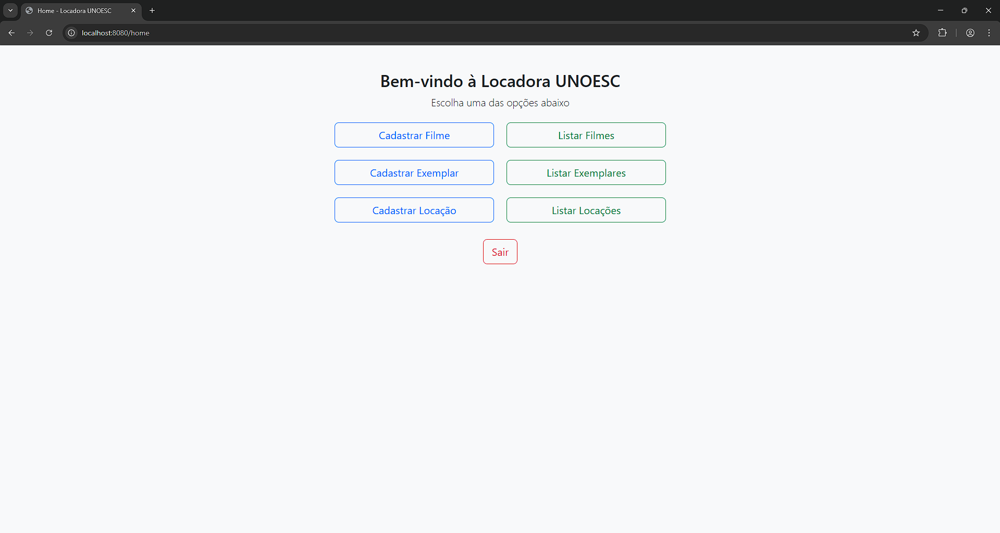
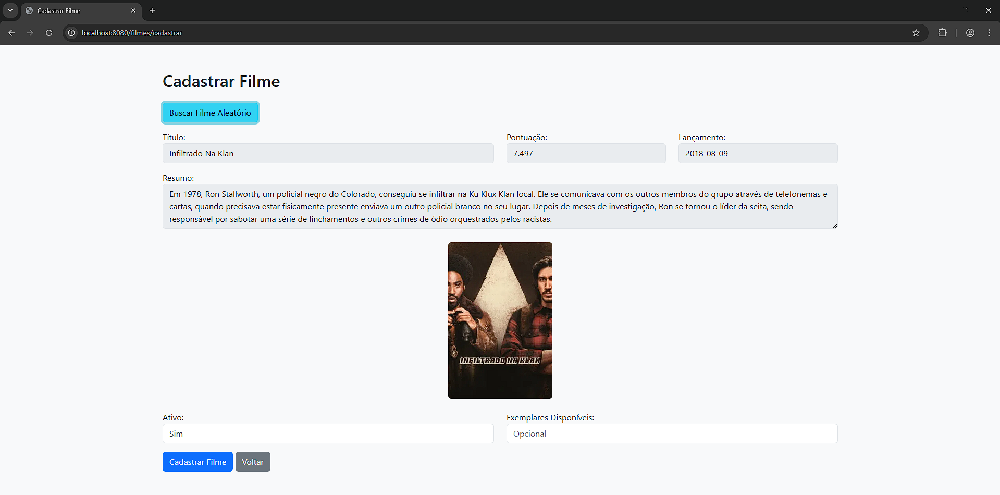
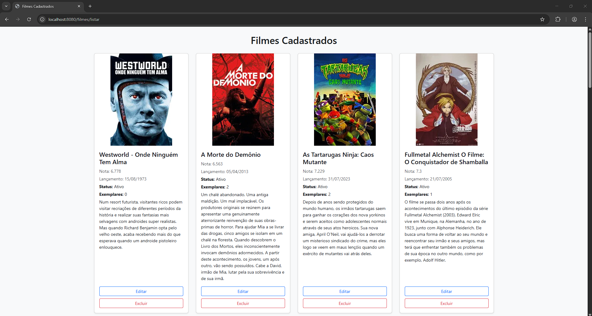
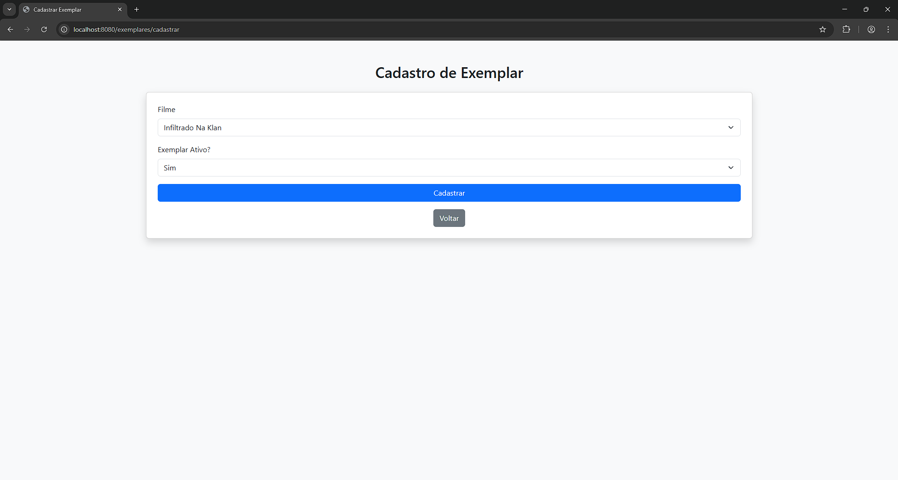
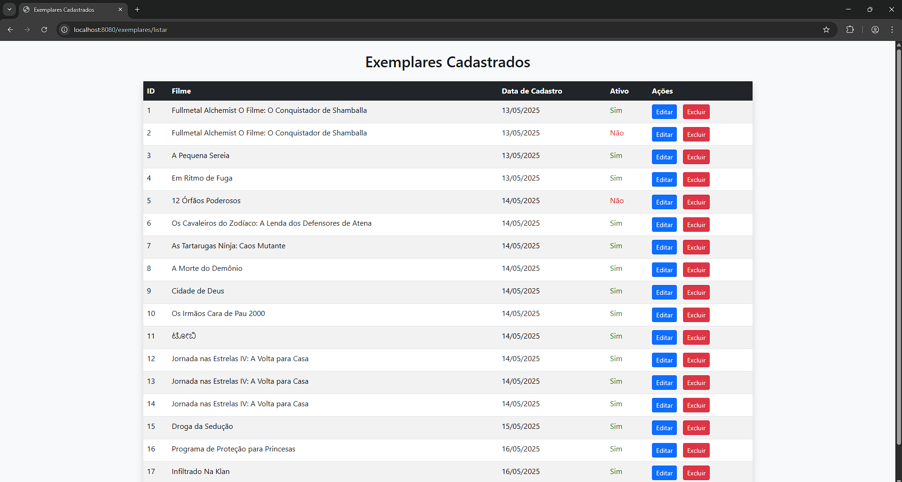
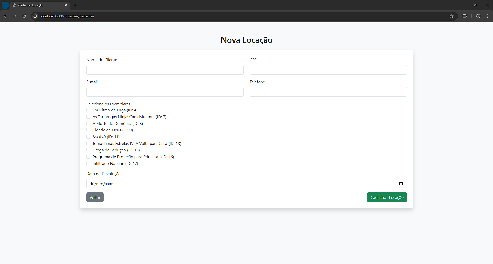
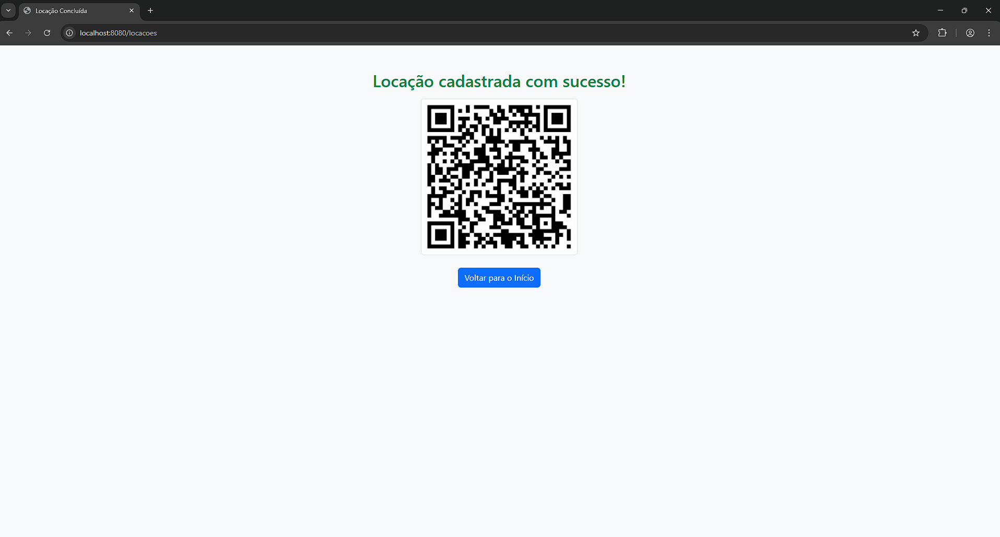
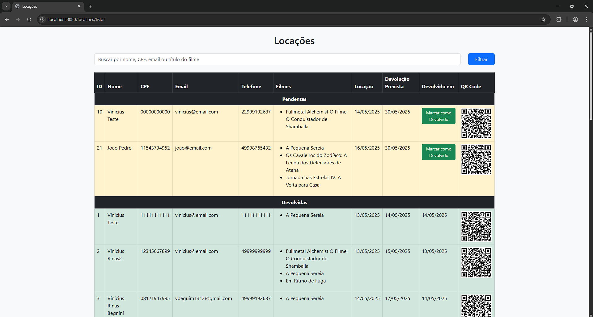
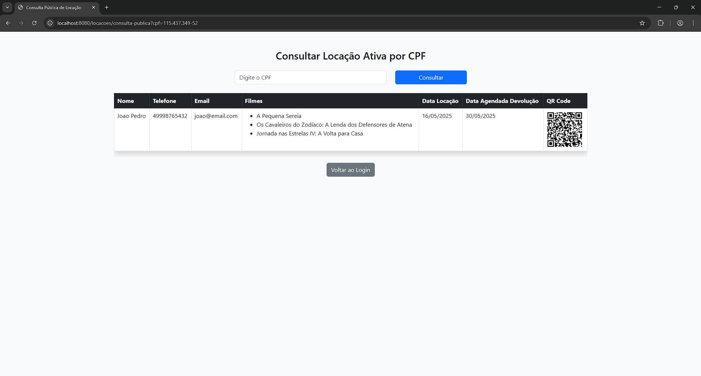

# Projeto Locadora - Desafio TI DEV UNOESC 2025/2

Projeto desenvolvido para o processo seletivo da vaga de **Programador Fullstack** da UNOESC. Trata-se de uma aplicação web para gestão de uma locadora de filmes em mídia física, com cadastro de filmes pela API The Movie DB, gerenciamento de exemplares e locações com geração de QR Code.

---

## Funcionalidades

- Cadastro de filmes com dados via API do The Movie DB
- Cadastro e edição de exemplares de filmes
- Locações com até 3 exemplares por vez, com validação de disponibilidade
- Geração de QR Code via API externa na conclusão da locação
- Consulta pública das locações
- Evita exclusões de registros com associação
- Login obrigatório para acesso ao sistema
- Máscaras para CPF e telefone
- Interface intuitiva com Bootstrap e Thymeleaf
- Mensagens de erros e sucesso

---

## Tecnologias Utilizadas

- Java 17
- Spring Boot
- Spring Data JPA/Hibernate
- Thymeleaf
- Bootstrap 5
- MySQL 5.7+
- JavaScript (vanilla)
- APIs externas:
  - TMDB (https://developer.themoviedb.org/)
  - QR Code Generator (https://api.apgy.in/qr/)

---

## Acesso ao Sistema

O sistema está protegido por uma tela de login fixa. Para acessar utilize as credenciais abaixo:

- **Usuário:** `admin`
- **Senha:** `admin`

> A senha é validada por hash usando BCrypt, para se ter uma maior segurança mesmo em um ambiente mais simples.

---

## Como Executar

### Pré-requisitos

- Java 17+
- MySQL 5.7 ou superior
- IDE como o VS Code
- Git

### Passos

1. Clone o repositório:

   ```
   git clone --branch desenvolvimento https://github.com/seu-usuario/seu-repositorio.git
   ```

2. Crie o banco de dados MySQL:

   ```sql
   CREATE DATABASE locadora CHARACTER SET utf8mb4 COLLATE utf8mb4_general_ci;
   ```

3. Configure seu banco de dados no arquivo `src/main/resources/application.properties`.

   ```properties
   spring.datasource.url=jdbc:mysql://localhost:3306/locadora?useSSL=false&serverTimezone=UTC
   spring.datasource.username=root
   spring.datasource.password=root
   ```

4. Rode o projeto com:
   
   ```
   ./mvnw spring-boot:run
   ```

5. Acesse no navegador:
   
   ```
   http://localhost:8080/login
   ```

---

## Prints da Aplicação

### Tela de Login


### Tela Inicial (Home)


### Cadastro de Filme


### Lista de Filmes


### Cadastro de Exemplar


### Lista de Exemplares


### Cadastro de Locação


### Confirmação de Locação com QR Code


### Lista de Locações


### Consulta Pública por CPF


---

## Autor

- **Vinicius Rinas Begnini**
- viniciusrbegnini@gmail.com
